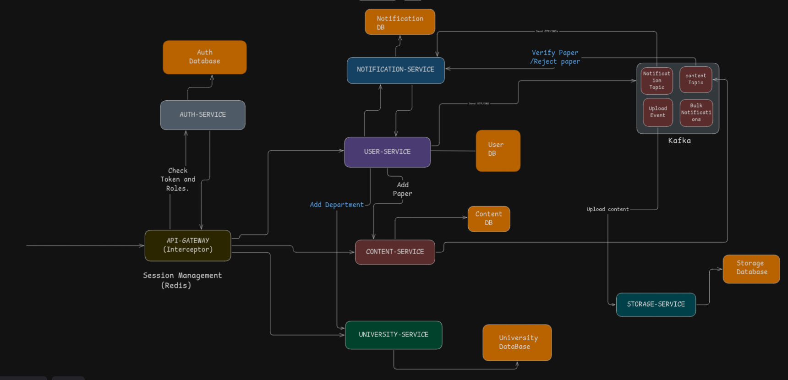
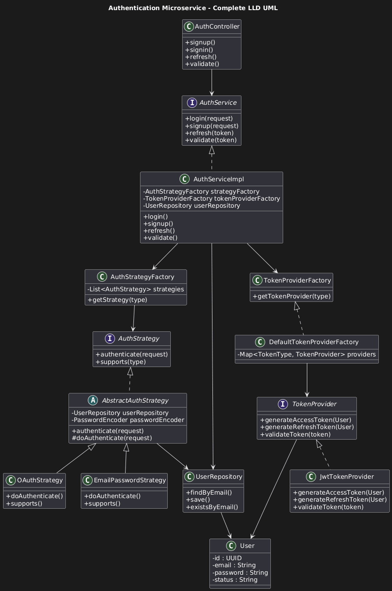
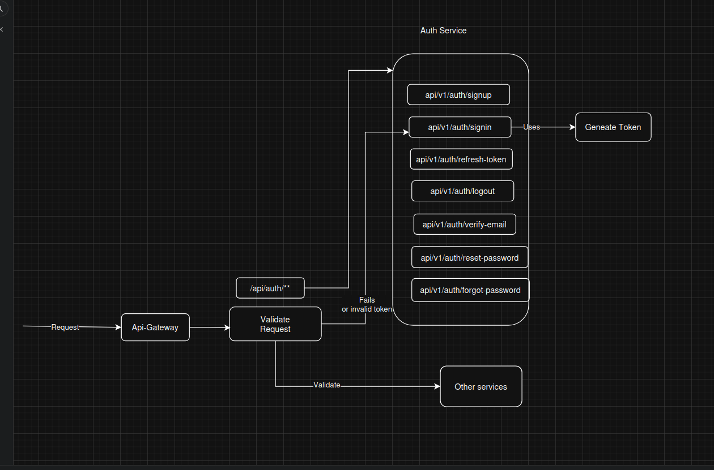
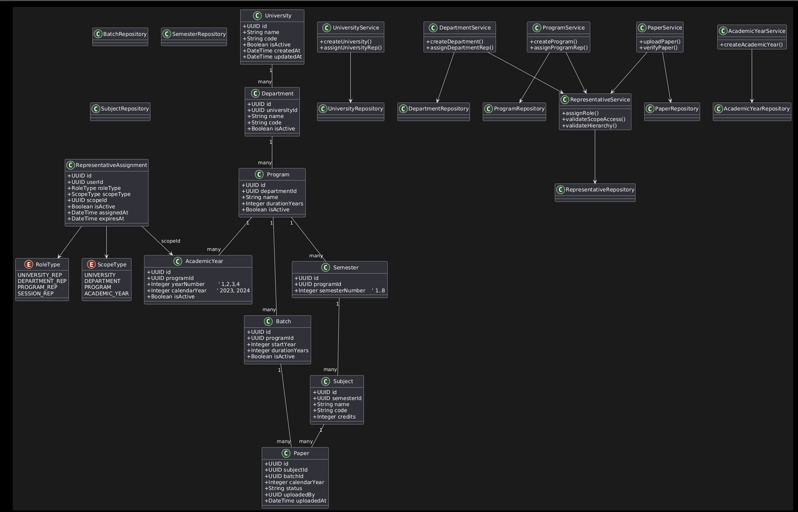
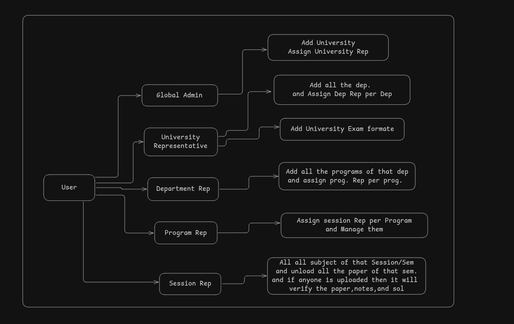
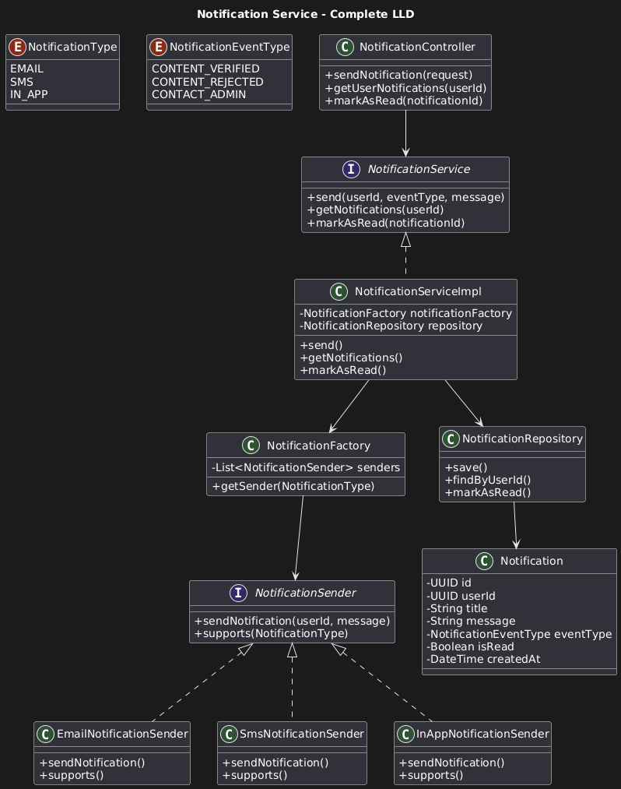
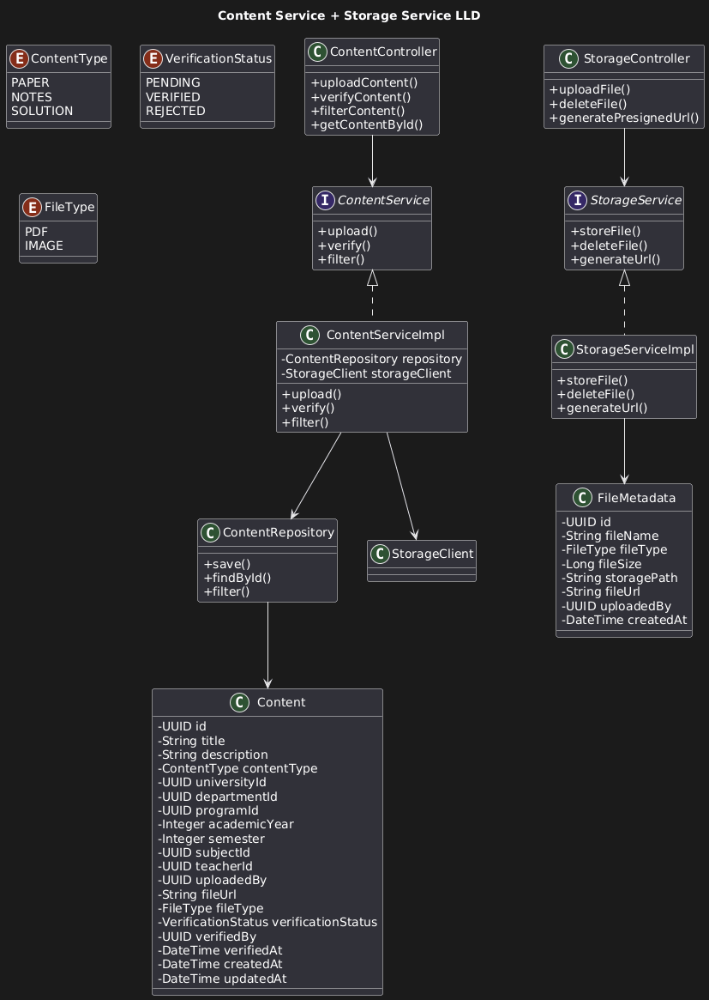
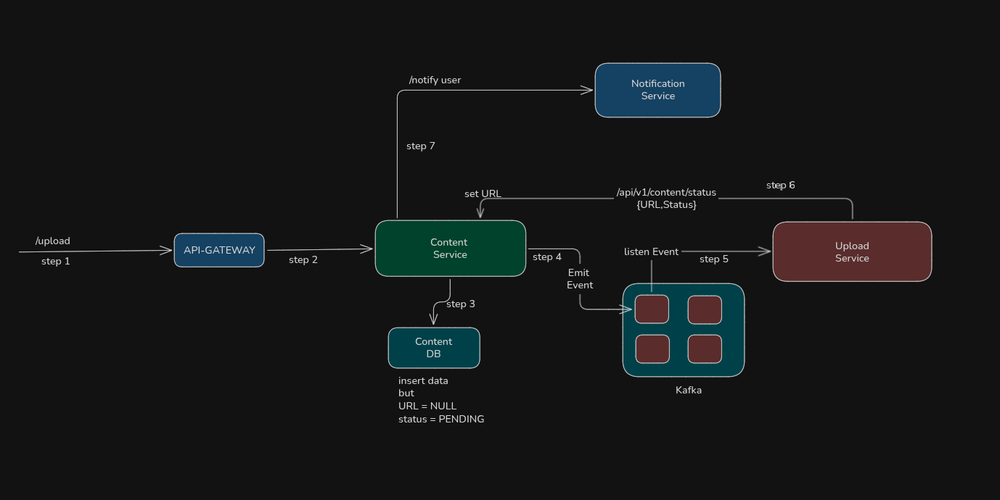
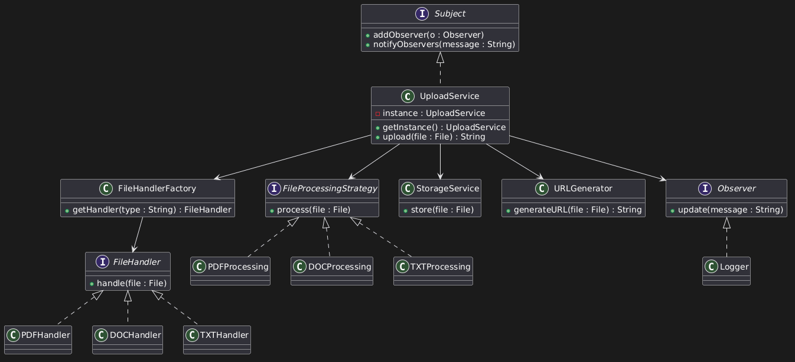

# PrevYear – University Content Sharing Platform

PrevYear is a **microservices-based backend system** designed to help university students access **previous year question papers, notes, and solutions**.

The system supports **secure authentication, content verification, academic hierarchy management, and scalable storage** using a **distributed microservices architecture**.

---

# System Architecture

The platform follows a **Microservices Architecture** where each service is responsible for a specific domain of the system.

Main components include:

* API Gateway
* Authentication Service
* User Service
* University Service
* Content Service
* Storage Service
* Notification Service

Each service manages its **own database** to maintain service independence and scalability.

### Architecture Diagram

---

# Software Requirement Specification (SRS)

 **Complete System Requirement Document**

 [Open SRS](Docs/SRS.pdf)

---

# Auth Service

The **Auth Service** is responsible for user authentication and authorization.

### Responsibilities

* User Signup
* User Login
* Token Generation
* Token Validation
* Token Refresh
* Role Identification
* Secure Authentication Strategies

### System Design

**Architecture Diagram**

**Authentication Flow Diagram**

### Entities

 **Database Schema**

 [Auth Service Entities](Docs/AuthService/AuthServiceEntities.pdf)

---

# University Service

The **University Service** manages the academic structure of universities and controls role-based permissions for academic representatives.

### Responsibilities

* Manage Universities
* Manage Departments
* Manage Programs
* Manage Subjects
* Assign Session Representatives
* Maintain Academic Hierarchy

### System Design

**Architecture Diagram**

**Roles & Responsibilities**

### Entities

 **Database Schema**

[University Service Entities](Docs/UniversityService/University_Service_Tables.pdf)

---

# Notification Service

The **Notification Service** is responsible for sending system notifications to users.

### Responsibilities

* Notify when content is uploaded
* Notify when content is verified
* Notify when content is rejected
* Send system alerts

### System Design

**Architecture Diagram**

---

# Content Service

The **Content Service** manages all academic content uploaded to the platform.

### Responsibilities

* Upload paper metadata
* Upload notes metadata
* Upload solution metadata
* Content verification workflow
* Content filtering and search
* Content ownership tracking

### System Design

**Architecture Diagram**

**Content Upload Flow**

### Entities

 **Database Schema**

 [Content Service Entities](Docs/ContentAndStorageService/Content_and_Storage_Service_LLD.pdf)

---

# Storage Service (Upload Service)

The **Storage Service** is responsible for storing files such as PDFs and images and generating secure file URLs.

### Responsibilities

* Store uploaded files
* Generate file URLs
* Manage file metadata
* Support PDF and image uploads
* Integrate with Content Service

### System Design

**Architecture Diagram**

---

# Microservices Used

| Service              | Responsibility                        |
| -------------------- | ------------------------------------- |
| Auth Service         | Authentication and token management   |
| User Service         | User profile and academic information |
| University Service   | Academic hierarchy management         |
| Content Service      | Manage uploaded academic content      |
| Storage Service      | File storage and URL generation       |
| Notification Service | Send system notifications             |

---

# Key System Features

* Microservices Architecture
* Independent Service Databases
* Secure JWT Authentication
* Role-based Access Control
* Content Verification Workflow
* Scalable File Storage
* Modular Service Design

---

# Future Enhancements

* Event-driven architecture using Kafka
* Distributed caching with Redis
* Service discovery using Eureka
* Centralized configuration server
* Kubernetes deployment
* Search indexing with Elasticsearch

---

# Project Goal

The goal of **PrevYear** is to create a **scalable and organized platform** where students can easily access verified academic resources such as:

* Previous year exam papers
* Study notes
* Paper solutions

while maintaining **data integrity, verification workflows, and academic hierarchy controls**.
