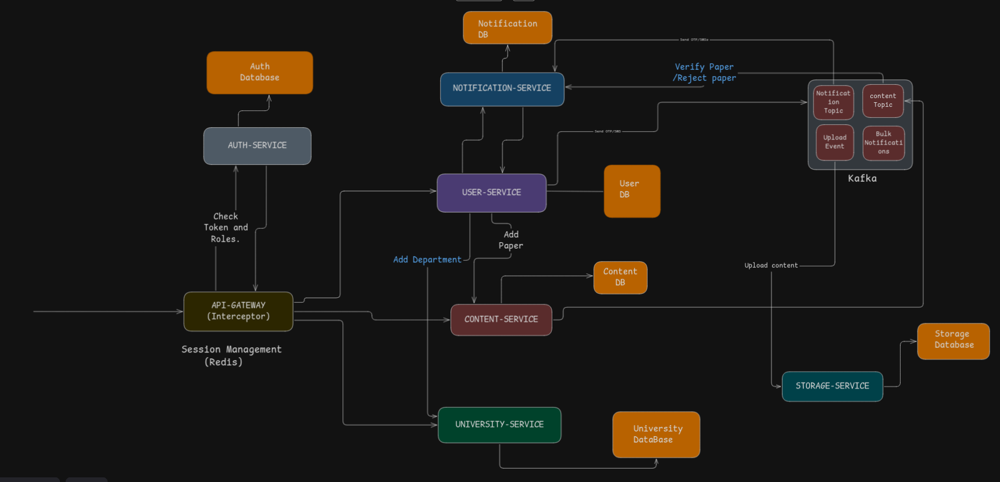
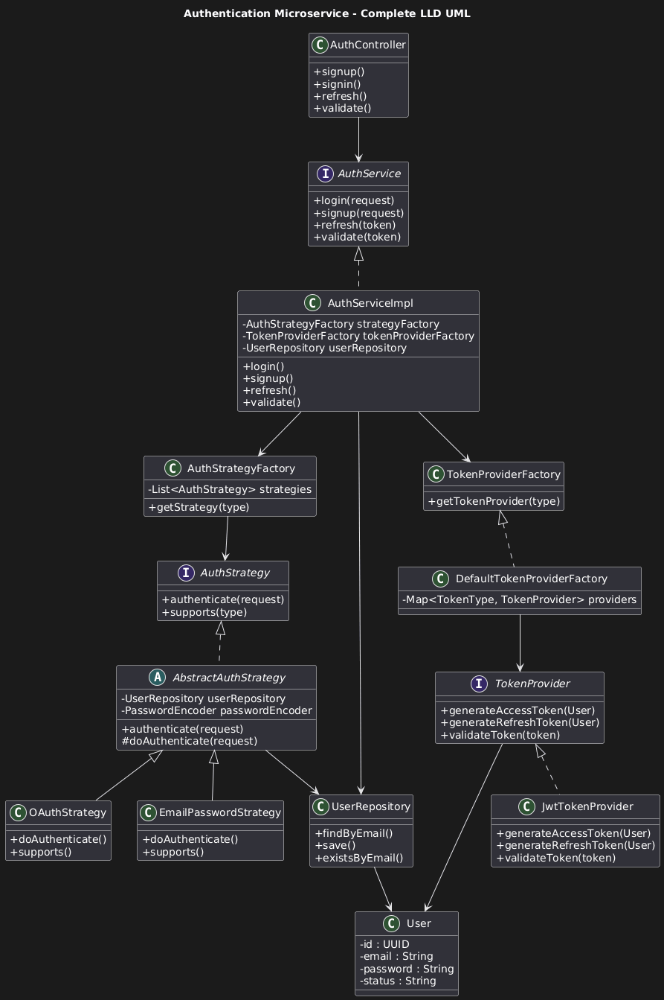
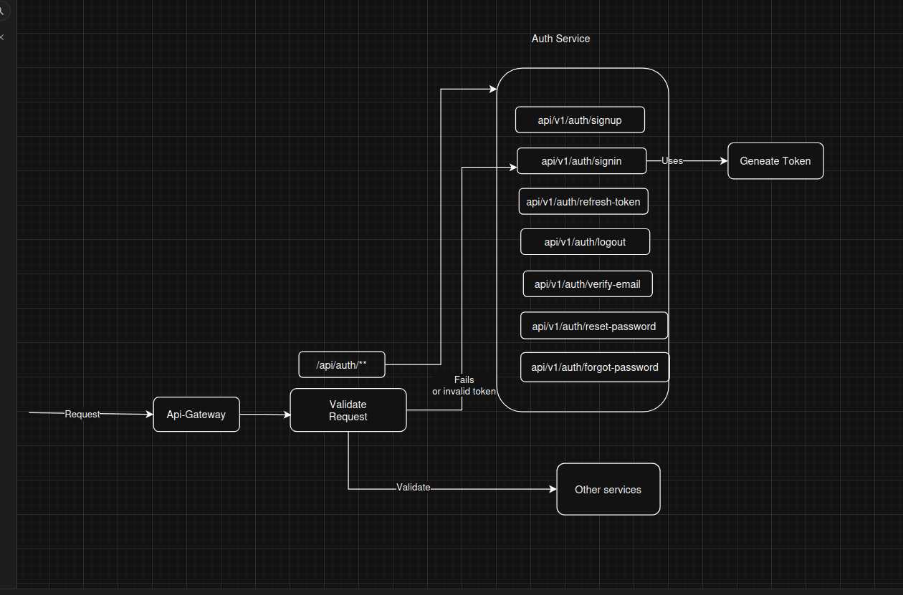
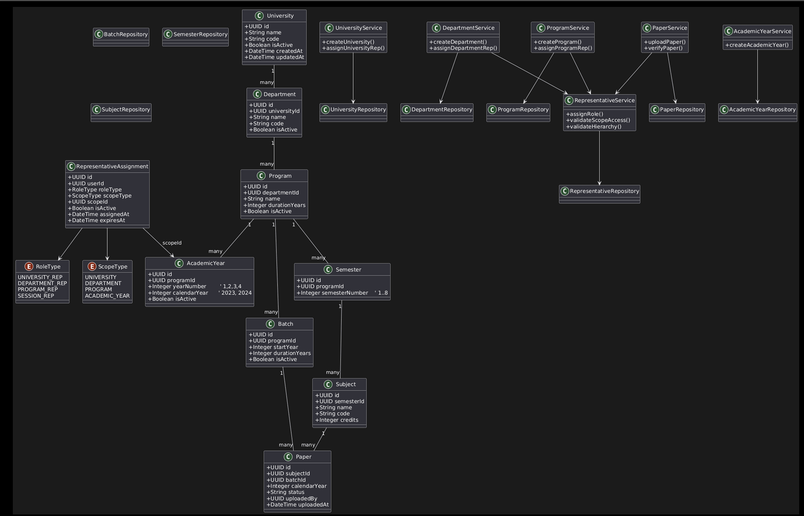
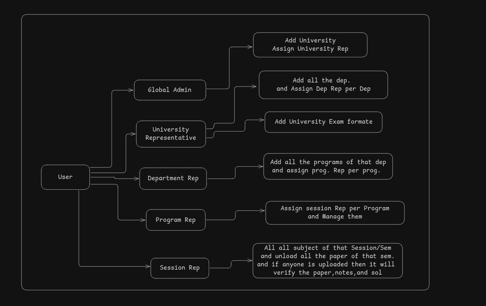
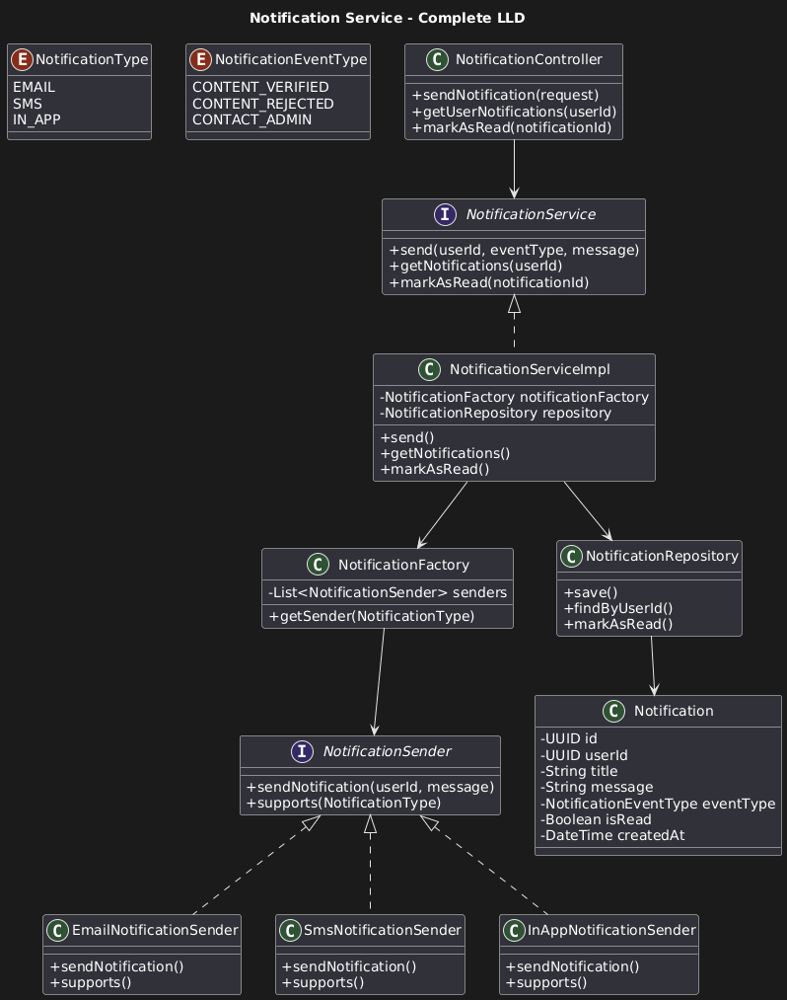
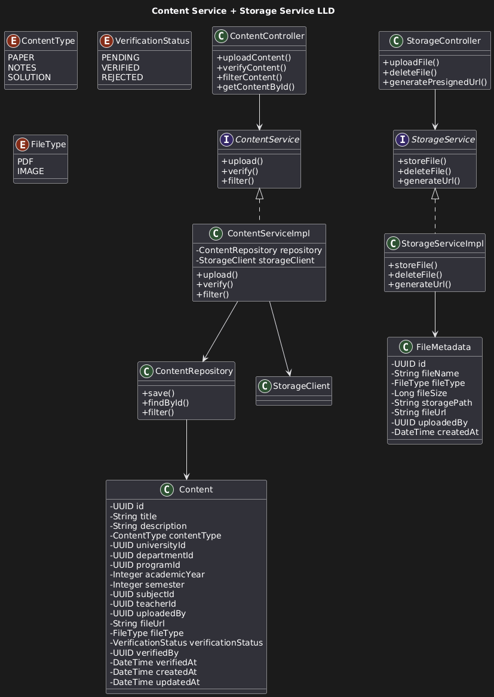
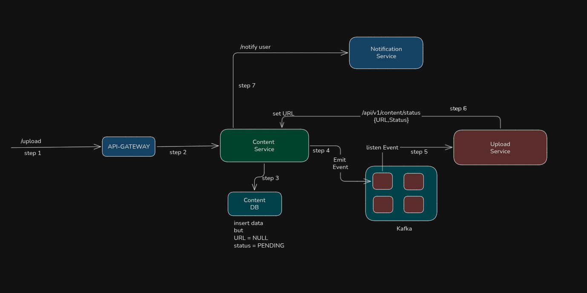
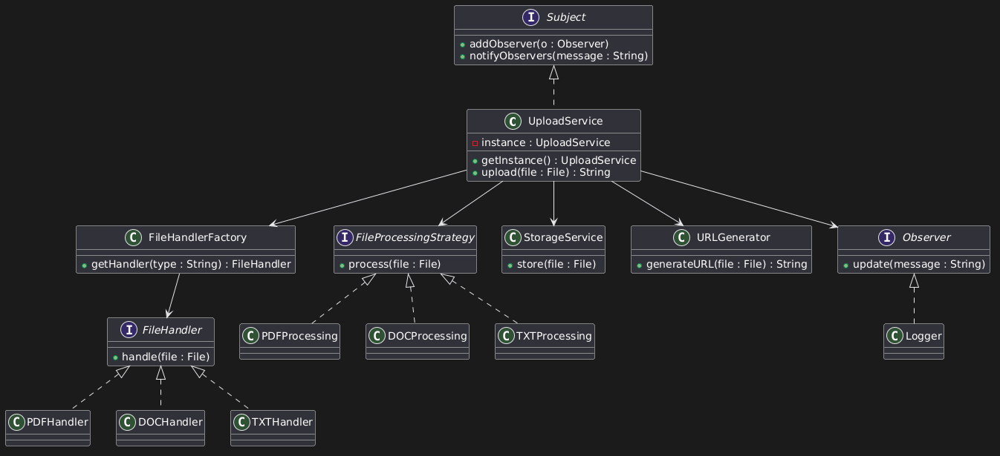
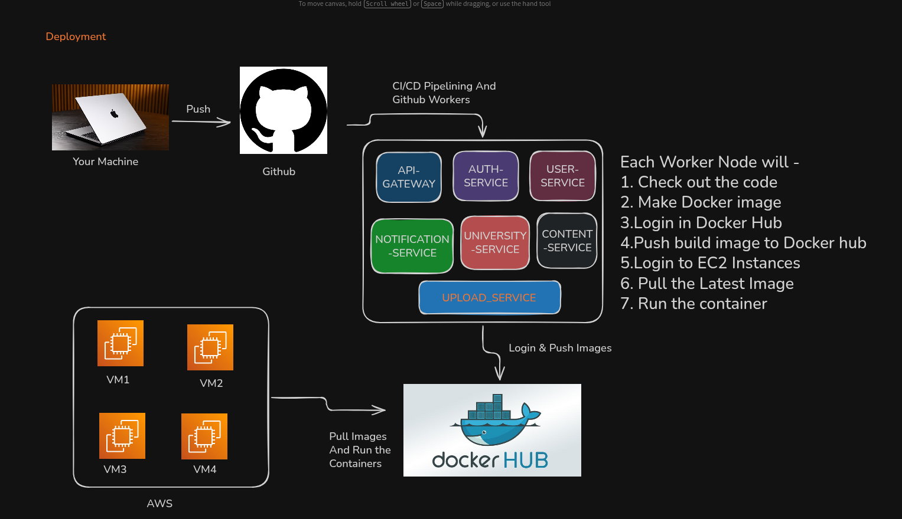

# PrevPaperApp – University Content Sharing Platform

PrevPaperApp is a **microservices-based backend system** designed to help university students access **previous year question papers, notes, and solutions**.

The system supports **secure authentication, content verification, academic hierarchy management, and scalable storage** using a **distributed microservices architecture**.

---

# System Architecture

The platform follows a **Microservices Architecture** where each service is responsible for a specific domain of the system.

Main components include:

* API Gateway
* Authentication Service
* User Service
* University Service
* Content Service
* Storage Service
* Notification Service

Each service manages its **own database** to maintain service independence and scalability.

### Architecture Diagram

---

# Software Requirement Specification (SRS)

 **Complete System Requirement Document**

 [Open SRS](Docs/SRS.pdf)

---

# Auth Service

The **Auth Service** is responsible for user authentication and authorization.

### Responsibilities

* User Signup
* User Login
* Token Generation
* Token Validation
* Token Refresh
* Role Identification
* Secure Authentication Strategies

### System Design

**Architecture Diagram**

**Authentication Flow Diagram**

### Entities

 **Database Schema**

 [Auth Service Entities](Docs/AuthService/AuthServiceEntities.pdf)

---

# University Service

The **University Service** manages the academic structure of universities and controls role-based permissions for academic representatives.

### Responsibilities

* Manage Universities
* Manage Departments
* Manage Programs
* Manage Subjects
* Assign Session Representatives
* Maintain Academic Hierarchy

### System Design

**Architecture Diagram**

**Roles & Responsibilities**

### Entities

 **Database Schema**

[University Service Entities](Docs/UniversityService/University_Service_Tables.pdf)

---

# Notification Service

The **Notification Service** is responsible for sending system notifications to users.

### Responsibilities

* Notify when content is uploaded
* Notify when content is verified
* Notify when content is rejected
* Send system alerts

### System Design

**Architecture Diagram**

---

# Content Service

The **Content Service** manages all academic content uploaded to the platform.

### Responsibilities

* Upload paper metadata
* Upload notes metadata
* Upload solution metadata
* Content verification workflow
* Content filtering and search
* Content ownership tracking

### System Design

**Architecture Diagram**

**Content Upload Flow**

### Entities

 **Database Schema**

 [Content Service Entities](Docs/ContentAndStorageService/Content_and_Storage_Service_LLD.pdf)

---

# Storage Service (Upload Service)

The **Storage Service** is responsible for storing files such as PDFs and images and generating secure file URLs.

### Responsibilities

* Store uploaded files
* Generate file URLs
* Manage file metadata
* Support PDF and image uploads
* Integrate with Content Service

### System Design

**Architecture Diagram**

---

# Microservices Used

| Service              | Responsibility                        |
| -------------------- | ------------------------------------- |
| Auth Service         | Authentication and token management   |
| User Service         | User profile and academic information |
| University Service   | Academic hierarchy management         |
| Content Service      | Manage uploaded academic content      |
| Storage Service      | File storage and URL generation       |
| Notification Service | Send system notifications             |

---

# Deployment Architecture & GitOps Pipeline

The production infrastructure for **PrevPaperApp** is designed around a fully automated, optimized GitOps pipeline that orchestrates the building, distribution, and runtime lifecycle of our microservices across a multi-node AWS EC2 environment.

### Deployment Workflow Diagram

---

## 🚀 Continuous Integration & Continuous Deployment (CI/CD)

Our deployment automation relies on a multi-stage GitHub Actions pipeline designed for rapid iteration, strict build isolation, and zero application downtime.

### 🔄 The Orchestration Lifecycle
## Deployment Pipeline Flow

1. **Smart Change Detection**
   Whenever code is pushed to the `main` branch, the pipeline checks exactly which files were modified. If changes are isolated to a single microservice (like the `auth-service`), only that specific service is updated. If a global configuration file (like `pom.xml`) is changed, the pipeline automatically updates all services in parallel. This keeps the build process incredibly fast.

2. **Parallel Matrix Build**
   GitHub Actions boots up to 7 isolated virtual worker nodes at the exact same time. Each active microservice builds on its own dedicated node, meaning no service blocks another, ensuring the entire application compiles as quickly as possible.

3. **Fast Docker Builds & Registry Push**
   Each worker node builds a Docker image for its respective microservice. It uses GitHub Actions caching to skip rebuilding unchanged image layers. Once built, the image is tagged with the unique Git commit ID (for strict version tracking) as well as a `:latest` tag, and then pushed securely to Docker Hub.

4. **Secure Control Plane Handshake**
   Once the fresh images are safe in the registry, GitHub Actions opens a secure, encrypted SSH tunnel directly to the private network of the destination servers using protected environment secrets.

5. **Isolated Workspace Provisioning**
   Inside the destination server, the pipeline creates an isolated directory specifically for that microservice. It then securely copies over only the relevant `docker-compose.yaml` file needed to configure that specific environment.

6. **Zero-Downtime Environment Launch**
   Finally, the pipeline sends commands over the secure connection telling the server to log into Docker Hub, pull down the new versioned images, and restart the containers. By using the `docker compose up -d --remove-orphans` command, the old app instances are instantly swapped out for the new ones with zero downtime or dropped traffic.
---

## 🖥️ Target Production Infrastructure Mapping

To maximize compute efficiency, fault isolation, and internal data security, the 7 microservice matrix targets are distributed across 4 distinct physical AWS EC2 environments within a private network mesh.

| Target Node | Host Control Secret | Environment Context | Deployed Container Subsystems |
| :--- | :--- | :--- | :--- |
| **Machine 1** | `API_GATEWAY_VM_HOST` | `vm1.env` | • API Gateway   • Zipkin Trace Engine |
| **Machine 2** | `AUTH_SERVICE_VM_HOST` `USER_SERVICE_VM_HOST` | `vm2.env` | • Auth Service   • User Service |
| **Machine 3** | `UNIVERSITY_SERVICE_VM_HOST` `NOTIFICATION_SERVICE_VM_HOST` | `vm3.env` | • University Service   • Notification Service |
| **Machine 4** | `CONTENT_SERVICE_VM_HOST` `UPLOAD_SERVICE_VM_HOST` | `vm4.env` | • Content Service   • Storage Service (Upload) |

---

### 💡 Core Engineering Highlights for Recruiters

* **Deterministic Traceability:** By linking production runtimes explicitly to their respective `github.sha` tags, any running container can instantly be traced backward to the exact line of code, author, and pull request that produced it.
* **Failsafe Shell Protections:** The orchestration scripts implement strict error traps (`set -eu`). If an environment configuration profile (`vmX.env`) is compromised, unreadable, or missing on the destination target, the pipeline forces a clean exit rather than allowing partial or broken application states.
* **Isolated Resource Control:** Instead of executing a single monolith runtime stack, each microservice operates inside its own isolated filesystem path on the host, meaning upgrades, restarts, and diagnostic logging for individual containers occur in complete isolation.

# Key System Features

* Microservices Architecture
* Independent Service Databases
* Secure JWT Authentication
* Role-based Access Control
* Content Verification Workflow
* Scalable File Storage
* Modular Service Design

---

# Future Enhancements

* Kubernetes deployment
* Gamification

---

# Project Goal

The goal of **PrevPaperApp** is to create a **scalable and organized platform** where students can easily access verified academic resources such as:

* Previous year exam papers
* Study notes
* Paper solutions

while maintaining **data integrity, verification workflows, and academic hierarchy controls**.
